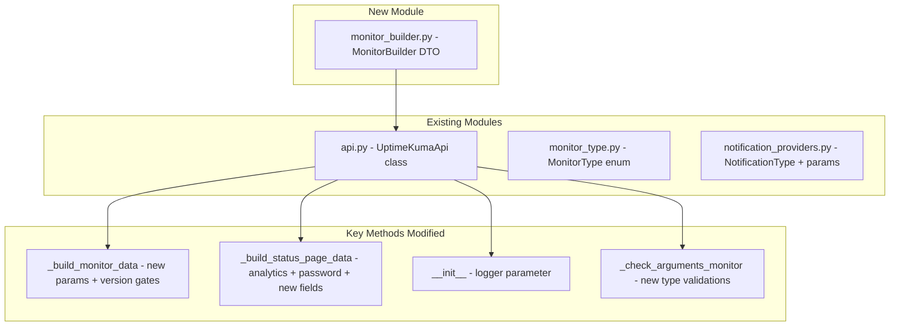

# Design Document: Uptime Kuma v2 Support Backlog

## Overview

This design covers the remaining v2 support work for the `uptime-kuma-api` Python library, building on the foundational v2 compatibility already shipped (conditions field + autoRefreshInterval fix). The backlog includes seven areas of work:

1. **New MonitorType enum values** — RabbitMQ, SNMP, SMTP, System Service
2. **New monitor parameters** — jsonPathOperator, ipFamily, HTTP params, PING params, MQTT params, low-priority params
3. **Status page changes** — analytics replacement, password removal, new v2 fields
4. **New notification providers** — Nextcloud Talk, Brevo, Evolution API
5. **Logger parameter** — custom logger injection into Socket.IO client
6. **MonitorBuilder DTO** — fluent builder pattern for monitor configuration
7. **Version detection enhancement** — automatic v2-only parameter gating

All changes maintain backward compatibility with v1.x instances. Where applicable, implementations are cherry-picked from PR #86 by @markus-seidl (excluding the `get_monitors` refactor and `conditions if conditions else list()` pattern).

## Architecture

The library's architecture remains unchanged — a single-file Socket.IO client (`api.py`) with supporting enum/data modules. The changes are additive:



### Version Gating Strategy

All v2-only parameters follow the existing pattern:

```python
if parse_version(self.version) >= parse_version("2.0"):
    data.update({
        "v2OnlyField": v2OnlyField,
    })
```

Parameters provided by the caller for v2-only fields are silently omitted when connected to v1. This is consistent with the `parse_version("1.22")` and `parse_version("1.23")` gates already in the codebase.

## Components and Interfaces

### 1. MonitorType Enum Additions (`monitor_type.py`)

Add four new enum members:

```python
RABBITMQ = "rabbitmq"
"""RabbitMQ"""

SNMP = "snmp"
"""SNMP"""

SMTP = "smtp"
"""SMTP"""

SYSTEM_SERVICE = "system-service"
"""System Service"""
```

### 2. `_build_monitor_data` Signature Extensions (`api.py`)

New parameters added to the method signature, grouped by category:

```python
def _build_monitor_data(
        self,
        type: MonitorType,
        name: str,
        # ... existing common params ...

        # JSON_QUERY (alongside existing jsonPath, expectedValue)
        jsonPathOperator: str = None,

        # Network monitors (HTTP, KEYWORD, JSON_QUERY, PING, PORT, DNS,
        #   STEAM, MQTT, RADIUS, TAILSCALE_PING, GRPC_KEYWORD, SNMP, SMTP, RABBITMQ)
        ipFamily: str = None,

        # HTTP, KEYWORD, JSON_QUERY, REAL_BROWSER
        cacheBust: bool = None,
        retryOnlyOnStatusCodeFailure: bool = None,
        bearer_token: str = None,
        oauth_audience: str = None,
        domainExpiryNotification: bool = None,
        saveResponse: bool = None,
        saveErrorResponse: bool = None,
        responseMaxLength: int = None,
        responsecheck: str = None,

        # PING
        ping_count: int = None,
        ping_numeric: bool = None,
        ping_per_request_timeout: int = None,

        # MQTT
        mqttWebsocketPath: str = None,
        mqttCheckType: str = None,

        # Low-priority / misc
        subtype: str = None,
        wsSubprotocol: str = None,
        wsIgnoreSecWebsocketAcceptHeader: bool = None,
        remoteBrowsersToggle: bool = None,
        remote_browser: str = None,
        screenshot_delay: int = None,
        gamedigToken: str = None,
        protocol: str = None,

        # RABBITMQ
        rabbitmqNodes: list = None,
        rabbitmqUsername: str = "",
        rabbitmqPassword: str = "",

        # SNMP
        snmpOid: str = None,
        snmpVersion: str = None,
        snmp_v3_username: str = None,

        # SMTP (monitor type)
        smtpSecurity: str = "starttls",

        # SYSTEM_SERVICE
        system_service_name: str = None,

        # ... existing trailing params (kafkaProducer*) ...
) -> dict:
```

### 3. `_build_monitor_data` Body Changes

**Validation additions** (at the top, before payload assembly):

```python
if responseMaxLength is not None and (responseMaxLength < 1 or responseMaxLength > 10_000_000):
    raise ValueError("responseMaxLength must be between 1 and 10,000,000")

if mqttCheckType is not None and mqttCheckType not in ("keyword", "json-query"):
    raise ValueError(f"mqttCheckType must be 'keyword' or 'json-query', got: {mqttCheckType}")

if mqttWebsocketPath is not None and len(mqttWebsocketPath) > 255:
    raise ValueError("mqttWebsocketPath must not exceed 255 characters")
```

**Type-conditional includes** (following existing patterns):

```python
# JSON_QUERY — add jsonPathOperator alongside existing jsonPath/expectedValue block
if type == MonitorType.JSON_QUERY:
    data.update({
        "jsonPath": jsonPath,
        "expectedValue": expectedValue,
    })
    if jsonPathOperator is not None:
        data["jsonPathOperator"] = jsonPathOperator

# SNMP — new type-specific block
if type == MonitorType.SNMP:
    data.update({
        "snmpOid": snmpOid,
        "snmpVersion": snmpVersion,
    })
    if snmp_v3_username is not None:
        data["snmp_v3_username"] = snmp_v3_username

# RABBITMQ — new type-specific block
if type == MonitorType.RABBITMQ:
    import json as _json
    data.update({
        "rabbitmqNodes": _json.dumps(rabbitmqNodes) if rabbitmqNodes else "[]",
        "rabbitmqUsername": rabbitmqUsername,
        "rabbitmqPassword": rabbitmqPassword,
    })

# SMTP (monitor) — new type-specific block
if type == MonitorType.SMTP:
    data.update({
        "smtpSecurity": smtpSecurity,
    })

# SYSTEM_SERVICE — new type-specific block
if type == MonitorType.SYSTEM_SERVICE:
    data.update({
        "system_service_name": system_service_name,
    })

# PING-specific params
if type == MonitorType.PING:
    if ping_count is not None:
        data["ping_count"] = ping_count
    if ping_numeric is not None:
        data["ping_numeric"] = ping_numeric
    if ping_per_request_timeout is not None:
        data["ping_per_request_timeout"] = ping_per_request_timeout

# MQTT new params
if type == MonitorType.MQTT:
    if mqttWebsocketPath is not None:
        data["mqttWebsocketPath"] = mqttWebsocketPath
    if mqttCheckType is not None:
        data["mqttCheckType"] = mqttCheckType
```

**Version-gated v2-only includes** (at the end, before `return data`):

```python
if parse_version(self.version) >= parse_version("2.0"):
    # Network monitors: ipFamily
    network_types = [
        MonitorType.HTTP, MonitorType.KEYWORD, MonitorType.JSON_QUERY,
        MonitorType.PING, MonitorType.PORT, MonitorType.DNS,
        MonitorType.STEAM, MonitorType.MQTT, MonitorType.RADIUS,
        MonitorType.TAILSCALE_PING, MonitorType.GRPC_KEYWORD,
        MonitorType.SNMP, MonitorType.SMTP, MonitorType.RABBITMQ,
    ]
    if type in network_types and ipFamily is not None:
        data["ipFamily"] = ipFamily

    # HTTP params
    http_types = [MonitorType.HTTP, MonitorType.KEYWORD, MonitorType.JSON_QUERY, MonitorType.REAL_BROWSER]
    if type in http_types:
        for field, value in [
            ("cacheBust", cacheBust),
            ("retryOnlyOnStatusCodeFailure", retryOnlyOnStatusCodeFailure),
            ("bearer_token", bearer_token),
            ("oauth_audience", oauth_audience),
            ("domainExpiryNotification", domainExpiryNotification),
            ("saveResponse", saveResponse),
            ("saveErrorResponse", saveErrorResponse),
            ("responseMaxLength", responseMaxLength),
            ("responsecheck", responsecheck),
        ]:
            if value is not None:
                data[field] = value

    # Low-priority params (not type-gated, just version-gated)
    for field, value in [
        ("subtype", subtype),
        ("wsSubprotocol", wsSubprotocol),
        ("wsIgnoreSecWebsocketAcceptHeader", wsIgnoreSecWebsocketAcceptHeader),
        ("remoteBrowsersToggle", remoteBrowsersToggle),
        ("remote_browser", remote_browser),
        ("screenshot_delay", screenshot_delay),
        ("gamedigToken", gamedigToken),
        ("protocol", protocol),
    ]:
        if value is not None:
            data[field] = value
```

### 4. `_check_arguments_monitor` Updates

Add new monitor types to `required_args_by_type`:

```python
required_args_by_type = {
    # ... existing entries ...
    MonitorType.RABBITMQ: ["rabbitmqNodes"],
    MonitorType.SNMP: ["hostname", "snmpOid"],
    MonitorType.SMTP: ["hostname"],
    MonitorType.SYSTEM_SERVICE: ["system_service_name"],
}
```

Also add port defaults in `_build_monitor_data`:

```python
if not port:
    if type == MonitorType.DNS:
        port = 53
    elif type == MonitorType.RADIUS:
        port = 1812
    elif type == MonitorType.SNMP:
        port = 161
    elif type == MonitorType.SMTP:
        port = 25
```

### 5. `_build_status_page_data` Changes

**New signature** (adds analytics + new fields, removes none):

```python
def _build_status_page_data(
        self,
        slug: str,
        id: int,
        title: str,
        description: str = None,
        theme: str = None,
        published: bool = True,
        showTags: bool = False,
        domainNameList: list = None,
        googleAnalyticsId: str = None,
        customCSS: str = "",
        footerText: str = None,
        showPoweredBy: bool = True,
        showCertificateExpiry: bool = False,
        icon: str = "/icon.svg",
        publicGroupList: list = None,
        # v2 analytics
        analyticsType: str = None,
        analyticsId: str = None,
        analyticsScriptUrl: str = None,
        # v2 password removal handled by omitting from config
        password: str = None,
        # v2 new fields
        showOnlyLastHeartbeat: bool = None,
        rssTitle: str = None,
) -> tuple[str, dict, str, list]:
```

**Body changes** (config dict assembly):

```python
config = {
    "id": id,
    "slug": slug,
    "title": title,
    "description": description,
    "icon": icon,
    "theme": theme,
    "published": published,
    "showTags": showTags,
    "domainNameList": domainNameList,
    "customCSS": customCSS,
    "footerText": footerText,
    "showPoweredBy": showPoweredBy,
}

if parse_version(self.version) >= parse_version("1.23"):
    config["showCertificateExpiry"] = showCertificateExpiry

if parse_version(self.version) >= parse_version("2.0"):
    # v2: use new analytics fields, omit googleAnalyticsId
    if analyticsType is not None:
        config["analyticsType"] = analyticsType
    if analyticsId is not None:
        config["analyticsId"] = analyticsId
    if analyticsScriptUrl is not None:
        config["analyticsScriptUrl"] = analyticsScriptUrl
    # v2: omit password entirely
    # v2: new fields
    if showOnlyLastHeartbeat is not None:
        config["showOnlyLastHeartbeat"] = showOnlyLastHeartbeat
    if rssTitle is not None:
        config["rssTitle"] = rssTitle
else:
    # v1: include googleAnalyticsId and password
    config["googleAnalyticsId"] = googleAnalyticsId
    if password is not None:
        config["password"] = password
```

**`save_status_page` changes** (pop fields that v2 may return but v1 doesn't understand):

```python
status_page = self.get_status_page(slug)
status_page.pop("incident")
status_page.pop("maintenanceList")
status_page.pop("autoRefreshInterval", None)  # already implemented
status_page.pop("googleAnalyticsId", None)     # v2 may not return this; pop defensively
status_page.update(kwargs)
data = self._build_status_page_data(**status_page)
```

### 6. Notification Provider Additions (`notification_providers.py`)

**New enum members:**

```python
NEXTCLOUD_TALK = "nextcloudtalk"
"""Nextcloud Talk"""

BREVO = "Brevo"
"""Brevo"""

EVOLUTION_API = "evolution"
"""Evolution API"""
```

**New provider option entries:**

```python
NotificationType.NEXTCLOUD_TALK: dict(
    host=dict(type="str", required=True),
    conversationToken=dict(type="str", required=True),
    botSecret=dict(type="str", required=True),
    sendSilentUp=dict(type="bool", required=False),
    sendSilentDown=dict(type="bool", required=False),
),
NotificationType.BREVO: dict(
    brevoApiKey=dict(type="str", required=True),
    brevoFromEmail=dict(type="str", required=True),
    brevoToEmail=dict(type="str", required=True),
    brevoFromName=dict(type="str", required=False),
    brevoCcEmail=dict(type="str", required=False),
    brevoBccEmail=dict(type="str", required=False),
    brevoSubject=dict(type="str", required=False),
),
NotificationType.EVOLUTION_API: dict(
    evolutionInstanceName=dict(type="str", required=True),
    evolutionAuthToken=dict(type="str", required=True),
    evolutionRecipient=dict(type="str", required=True),
    evolutionApiUrl=dict(type="str", required=False),
    evolutionUseCustomMessage=dict(type="bool", required=False),
    evolutionCustomMessage=dict(type="str", required=False),
),
```

### 7. Logger Parameter (`api.py` — `UptimeKumaApi.__init__`)

**Updated constructor:**

```python
def __init__(
        self,
        url: str,
        timeout: float = 10,
        headers: dict = None,
        ssl_verify: bool = True,
        wait_events: float = 0.2,
        logger=None,
) -> None:
    import logging

    if logger is not None and not isinstance(logger, (logging.Logger, bool)):
        raise TypeError("logger must be a logging.Logger instance, a bool, or None")

    self.url = url.rstrip("/")
    self.timeout = timeout
    self.headers = headers
    self.wait_events = wait_events

    sio_kwargs = {"ssl_verify": ssl_verify}
    if logger is not None:
        sio_kwargs["logger"] = logger
    self.sio = socketio.Client(**sio_kwargs)
    # ... rest unchanged ...
```

### 8. MonitorBuilder DTO (`monitor_builder.py` — new file)

```python
from .monitor_type import MonitorType


class MonitorBuilder:
    """Fluent builder for constructing monitor configuration dictionaries."""

    def __init__(self):
        self._data = {}

    def type(self, value: MonitorType) -> "MonitorBuilder":
        self._data["type"] = value
        return self

    def name(self, value: str) -> "MonitorBuilder":
        self._data["name"] = value
        return self

    # ... setter methods for ALL _build_monitor_data parameters ...
    # Each follows the pattern:
    # def param_name(self, value) -> "MonitorBuilder":
    #     self._data["param_name"] = value
    #     return self

    def build(self) -> dict:
        missing = []
        if "type" not in self._data:
            missing.append("type")
        if "name" not in self._data:
            missing.append("name")
        if missing:
            raise ValueError(f"Required fields not set: {', '.join(missing)}")
        return dict(self._data)
```

The `build()` output is directly passable to `add_monitor(**builder.build())` or `edit_monitor(id_, **builder.build())`.

### 9. Module Exports (`__init__.py`)

Add `MonitorBuilder` to the package exports:

```python
from .monitor_builder import MonitorBuilder
```

## Data Models

### New Monitor Type Parameters

| Monitor Type | Required Fields | Optional Fields |
|---|---|---|
| RABBITMQ | `rabbitmqNodes` (list) | `rabbitmqUsername` (str), `rabbitmqPassword` (str) |
| SNMP | `hostname` (str), `snmpOid` (str) | `port` (int, default 161), `snmpVersion` (str), `snmp_v3_username` (str), `jsonPath`, `jsonPathOperator`, `expectedValue` |
| SMTP | `hostname` (str) | `port` (int, default 25), `smtpSecurity` (str, default "starttls") |
| SYSTEM_SERVICE | `system_service_name` (str) | — |

### Status Page Config Payload (v2)

```python
{
    "id": 1,
    "slug": "my-page",
    "title": "My Status Page",
    "description": "...",
    "icon": "/icon.svg",
    "theme": "auto",
    "published": True,
    "showTags": False,
    "domainNameList": [],
    "customCSS": "",
    "footerText": None,
    "showPoweredBy": True,
    "showCertificateExpiry": False,
    # v2 analytics (replaces googleAnalyticsId)
    "analyticsType": "plausible",
    "analyticsId": "my-domain.com",
    "analyticsScriptUrl": "https://plausible.io/js/script.js",
    # v2 new fields
    "showOnlyLastHeartbeat": True,
    "rssTitle": "Custom RSS Title",
    # password: OMITTED in v2
}
```

### Notification Provider Schemas

| Provider | Required | Optional |
|---|---|---|
| Nextcloud Talk | `host`, `conversationToken`, `botSecret` | `sendSilentUp`, `sendSilentDown` |
| Brevo | `brevoApiKey`, `brevoFromEmail`, `brevoToEmail` | `brevoFromName`, `brevoCcEmail`, `brevoBccEmail`, `brevoSubject` |
| Evolution API | `evolutionInstanceName`, `evolutionAuthToken`, `evolutionRecipient` | `evolutionApiUrl`, `evolutionUseCustomMessage`, `evolutionCustomMessage` |

### MonitorBuilder DTO Interface

```python
builder = MonitorBuilder()
config = (
    builder
    .type(MonitorType.HTTP)
    .name("My Monitor")
    .url("https://example.com")
    .interval(60)
    .conditions([{"type": "expression", "variable": "response_status", "operator": "==", "value": "200", "andOr": ""}])
    .build()
)
# config == {"type": MonitorType.HTTP, "name": "My Monitor", "url": "https://example.com", "interval": 60, "conditions": [...]}
api.add_monitor(**config)
```


## Correctness Properties

*A property is a characteristic or behavior that should hold true across all valid executions of a system — essentially, a formal statement about what the system should do. Properties serve as the bridge between human-readable specifications and machine-verifiable correctness guarantees.*

### Property 1: New monitor type payload assembly

*For any* new monitor type (RABBITMQ, SNMP, SMTP, SYSTEM_SERVICE) and any valid combination of that type's specific parameters, calling `_build_monitor_data` with that type SHALL produce a dict containing all provided type-specific parameters with their values unchanged, and SHALL NOT raise an exception.

**Validates: Requirements 1.2, 1.3, 1.4, 1.5**

### Property 2: jsonPathOperator conditional inclusion

*For any* MonitorType value and any non-None `jsonPathOperator` string, calling `_build_monitor_data` SHALL include `"jsonPathOperator"` in the output dict if and only if the type is `JSON_QUERY`. For all other types, the key SHALL be absent from the output regardless of the value provided.

**Validates: Requirements 2.1, 2.2, 2.3**

### Property 3: ipFamily conditional inclusion with version gate

*For any* MonitorType value, any non-None `ipFamily` string, and any server version: `_build_monitor_data` SHALL include `"ipFamily"` in the output dict if and only if the type is one of the designated network types (HTTP, KEYWORD, JSON_QUERY, PING, PORT, DNS, STEAM, MQTT, RADIUS, TAILSCALE_PING, GRPC_KEYWORD, SNMP, SMTP, RABBITMQ) AND the connected server version >= 2.0. In all other cases, the key SHALL be absent.

**Validates: Requirements 2.4, 2.5, 2.6, 13.2, 13.3, 13.4**

### Property 4: HTTP params conditional inclusion with version gate

*For any* HTTP-family monitor type (HTTP, KEYWORD, JSON_QUERY, REAL_BROWSER), any server version >= 2.0, and any subset of HTTP parameters (`cacheBust`, `retryOnlyOnStatusCodeFailure`, `bearer_token`, `oauth_audience`, `domainExpiryNotification`, `saveResponse`, `saveErrorResponse`, `responseMaxLength`, `responsecheck`) where each provided value is non-None: the output dict SHALL contain exactly those provided parameters with their values unchanged. Parameters left as None SHALL NOT appear as keys in the output.

**Validates: Requirements 3.1, 3.2, 3.3, 3.5**

### Property 5: responseMaxLength range validation

*For any* integer value outside the range [1, 10,000,000], passing it as `responseMaxLength` to `_build_monitor_data` SHALL raise a `ValueError`.

**Validates: Requirements 3.4**

### Property 6: bearer_token independence from authMethod

*For any* `authMethod` value and any non-None `bearer_token` string, when the monitor type is an HTTP-family type and the server version >= 2.0, the output dict SHALL contain `"bearer_token"` regardless of what `authMethod` is set to.

**Validates: Requirements 3.5**

### Property 7: PING params conditional inclusion

*For any* subset of PING parameters (`ping_count`, `ping_numeric`, `ping_per_request_timeout`) where each provided value is non-None: when the monitor type is PING, the output dict SHALL contain exactly those provided parameters. When the type is not PING, those keys SHALL be absent.

**Validates: Requirements 4.1, 4.2, 4.3**

### Property 8: MQTT params conditional inclusion and validation

*For any* valid `mqttWebsocketPath` (string ≤ 255 chars) and valid `mqttCheckType` (one of `"keyword"`, `"json-query"`): when the monitor type is MQTT, the output dict SHALL contain those fields. For invalid `mqttCheckType` values (not None, not "keyword", not "json-query"), `_build_monitor_data` SHALL raise a `ValueError`. For `mqttWebsocketPath` exceeding 255 characters, `_build_monitor_data` SHALL raise a `ValueError`.

**Validates: Requirements 5.1, 5.2, 5.3, 5.4**

### Property 9: Low-priority params version-gated inclusion

*For any* subset of low-priority parameters (`subtype`, `wsSubprotocol`, `wsIgnoreSecWebsocketAcceptHeader`, `remoteBrowsersToggle`, `remote_browser`, `screenshot_delay`, `gamedigToken`, `protocol`) where each provided value is non-None: when the server version >= 2.0, the output dict SHALL contain exactly those provided parameters. When the server version < 2.0, those keys SHALL be absent regardless of values provided.

**Validates: Requirements 6.1, 6.2, 6.3, 13.2, 13.3**

### Property 10: Status page version-gated field routing

*For any* status page configuration with analytics parameters (`analyticsType`, `analyticsId`, `analyticsScriptUrl`), `googleAnalyticsId`, `password`, `showOnlyLastHeartbeat`, and `rssTitle`:
- When version >= 2.0: the config dict SHALL contain v2 analytics fields (if non-None), `showOnlyLastHeartbeat` (if non-None), `rssTitle` (if non-None), and SHALL NOT contain `googleAnalyticsId` or `password`.
- When version < 2.0: the config dict SHALL contain `googleAnalyticsId`, SHALL contain `password` (if non-None), and SHALL NOT contain v2 analytics fields, `showOnlyLastHeartbeat`, or `rssTitle`.

**Validates: Requirements 7.1, 7.2, 7.3, 7.4, 8.1, 8.2, 8.5, 9.2, 9.3, 9.4**

### Property 11: Logger type validation

*For any* value that is not a `logging.Logger` instance, not a `bool`, and not `None` (including `int`, `str`, `list`, `dict`, `tuple`), passing it as the `logger` parameter to `UptimeKumaApi.__init__` SHALL raise a `TypeError`.

**Validates: Requirements 11.4**

### Property 12: MonitorBuilder setter chaining

*For any* setter method on `MonitorBuilder` and any valid argument value, calling the setter SHALL return the same `MonitorBuilder` instance (identity, not equality), enabling method chaining.

**Validates: Requirements 12.2**

### Property 13: MonitorBuilder build contains exactly set fields

*For any* subset of valid monitor parameter names and their values, setting exactly those fields on a `MonitorBuilder` instance (including `type` and `name`) and calling `build()` SHALL return a dict whose keys are exactly the set of fields that were explicitly set, and whose values match the most recently provided value for each field.

**Validates: Requirements 12.3, 12.5**

## Error Handling

| Scenario | Behavior |
|----------|----------|
| `responseMaxLength` < 1 or > 10,000,000 | `ValueError` raised before payload assembly |
| `mqttCheckType` not in (None, "keyword", "json-query") | `ValueError` raised before payload assembly |
| `mqttWebsocketPath` length > 255 | `ValueError` raised before payload assembly |
| `logger` is wrong type | `TypeError` raised in `__init__` before Socket.IO client created |
| `MonitorBuilder.build()` without type or name | `ValueError` with missing field names |
| New monitor type missing required field | `TypeError` raised by `_check_arguments_monitor` before emit |
| `version` accessed before info event | `UptimeKumaException` raised |
| v2 analytics params passed to v1 instance | Silently omitted, no error |
| `password` param passed to v2 instance | Silently omitted, no error |
| Unknown fields returned by v2 server in get_status_page | Defensively popped before `_build_status_page_data` |

## Testing Strategy

### Property-Based Tests (Hypothesis, minimum 100 iterations each)

Property-based testing is well-suited here because `_build_monitor_data` and `_build_status_page_data` are pure data-transformation functions with large input spaces (many enum values, arbitrary strings/ints/bools, version combinations).

**Library:** [Hypothesis](https://hypothesis.readthedocs.io/) for Python

Each property test MUST:
- Run a minimum of 100 iterations
- Reference its design property via tag comment: `# Feature: uptime-kuma-v2-support-backlog, Property N: <title>`

| Property | Generator Strategy |
|----------|---|
| 1 (new type payload) | `st.sampled_from([RABBITMQ, SNMP, SMTP, SYSTEM_SERVICE])` + type-specific param generators |
| 2 (jsonPathOperator) | `st.sampled_from(MonitorType)` × `st.text()` |
| 3 (ipFamily) | `st.sampled_from(MonitorType)` × `st.text()` × `st.sampled_from(["1.23", "2.0", "2.4"])` |
| 4 (HTTP params) | `st.sampled_from(http_types)` × `st.fixed_dictionaries(...)` with optional fields |
| 5 (responseMaxLength) | `st.integers().filter(lambda x: x < 1 or x > 10_000_000)` |
| 6 (bearer_token) | `st.sampled_from(AuthMethod)` × `st.text(min_size=1)` |
| 7 (PING params) | `st.booleans()` for ping_numeric, `st.integers(min_value=1)` for counts |
| 8 (MQTT validation) | `st.text()` for paths, `st.text().filter(...)` for invalid check types |
| 9 (low-priority) | `st.fixed_dictionaries(...)` × version strings |
| 10 (status page routing) | Full status page param generators × version strings |
| 11 (logger validation) | `st.one_of(st.integers(), st.text(), st.lists(...), st.dictionaries(...))` |
| 12 (builder chaining) | `st.sampled_from(setter_methods)` × appropriate value generators |
| 13 (builder output) | `st.sets(st.sampled_from(param_names))` for field subsets |

### Unit Tests (Example-Based)

- Each new monitor type: create with all required fields → verify success response shape
- Each new monitor type: omit each required field one-at-a-time → verify validation error
- Notification providers: create with required fields → verify success
- Notification providers: omit each required field → verify error
- Logger: pass `logging.getLogger("test")` → verify Socket.IO client receives it
- Logger: pass `None` → verify Socket.IO client created without logger kwarg
- Logger: pass `True` → verify accepted (boolean is valid for python-socketio)
- MonitorBuilder: chain `.type().name().url().build()` → verify dict shape
- MonitorBuilder: call `.build()` without type → verify ValueError
- MonitorBuilder: call setter twice with different values → verify last wins
- Status page save: mock server returning `googleAnalyticsId` in v2 → verify popped
- Status page save: mock server returning `showOnlyLastHeartbeat` → verify passed through
- edit_monitor: mock get_monitor returning low-priority values → verify preserved

### Integration Tests

Run against Docker containers with Uptime Kuma v2.4.0 and v1.23.x:
- Create/edit/delete monitors of each new type on v2
- Create notifications with each new provider on v2
- Save status page with v2 analytics fields on v2
- Verify v2-only params silently omitted on v1
- Verify MonitorBuilder output works end-to-end with `add_monitor`
