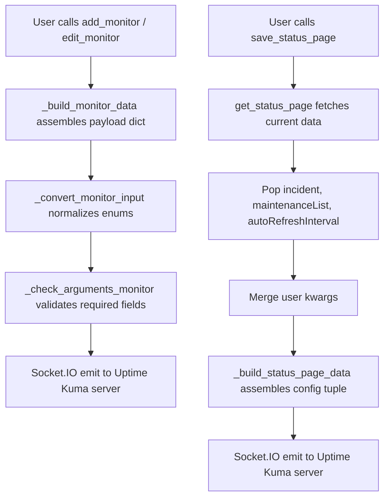

# Design Document: Uptime Kuma v2 Support

## Overview

This design addresses the compatibility gap between the `uptime-kuma-api` Python library and Uptime Kuma v2.x. The core issue is that Uptime Kuma v2 introduced a required `conditions` column on the `monitor` table (`NOT NULL` constraint), and removed the `autoRefreshInterval` field from status pages. The library currently omits `conditions` from monitor payloads and does not safely handle the missing `autoRefreshInterval` field, causing crashes on both monitor creation and status page saving when connected to v2 instances.

The fix is minimal and surgical:
1. Add `conditions` to the **common** section of `_build_monitor_data` so all monitor types include it.
2. Safely pop `autoRefreshInterval` from status page data before passing to `_build_status_page_data`.

Both changes maintain full backward compatibility with Uptime Kuma v1.x — sending `conditions: []` to v1 is accepted silently, and `pop("autoRefreshInterval", None)` is a no-op when the field doesn't exist.

## Architecture

The library's architecture is a single-file Socket.IO client (`api.py`) that wraps Uptime Kuma's WebSocket API. The key data flow for the affected operations:



No new modules, classes, or architectural changes are required. The fix modifies two existing methods in `api.py`.

## Components and Interfaces

### Modified Component: `_build_monitor_data`

**Current signature** (partial, showing the change area):
```python
def _build_monitor_data(self, type: MonitorType, name: str, ..., kafkaProducerSaslOptions: dict = None) -> dict:
```

**New signature** (adds `conditions` parameter in the common section):
```python
def _build_monitor_data(self, type: MonitorType, name: str, ...,
                        conditions: list = None,
                        ..., kafkaProducerSaslOptions: dict = None) -> dict:
```

**Behavior change**: At the top of the method body, after building the initial `data` dict, add:
```python
if conditions is not None and not isinstance(conditions, list):
    raise TypeError("conditions must be a list or None")
data["conditions"] = conditions if conditions is not None else []
```

This places `conditions` in the common data section (not gated by monitor type), ensuring all monitor types include it.

### Modified Component: `save_status_page`

**Current code**:
```python
status_page = self.get_status_page(slug)
status_page.pop("incident")
status_page.pop("maintenanceList")
status_page.update(kwargs)
data = self._build_status_page_data(**status_page)
```

**New code**:
```python
status_page = self.get_status_page(slug)
status_page.pop("incident")
status_page.pop("maintenanceList")
status_page.pop("autoRefreshInterval", None)
status_page.update(kwargs)
data = self._build_status_page_data(**status_page)
```

The `pop("autoRefreshInterval", None)` safely removes the field if present (v2) and is a no-op if absent (v1). This prevents `TypeError: _build_status_page_data() got an unexpected keyword argument 'autoRefreshInterval'`.

### Unchanged Component: `edit_monitor`

The existing `edit_monitor` flow already handles conditions correctly with the proposed changes:
```python
data = self.get_monitor(id_)  # Fetches current monitor data (may or may not have "conditions")
data.update(kwargs)            # User overrides (including conditions if supplied)
```

When `_build_monitor_data` is NOT called (edit uses `_call('editMonitor', data)` directly with the merged dict), the `conditions` field from `get_monitor` passes through. If the server returned `conditions: [...]`, it's preserved. If it didn't return `conditions` (v1), the field won't be in the dict — but since edit sends the raw dict to the server, v1 ignores unknown fields and v2 would already have conditions in the fetched data.

**Note**: Looking at the actual `edit_monitor` code, it calls `self._call('editMonitor', data)` directly with the merged dict from `get_monitor`. It does NOT go through `_build_monitor_data`. So the `conditions` field is preserved from the fetched data naturally. If a user passes `conditions=None` as a kwarg to `edit_monitor`, the dict will contain `"conditions": None` — the server handles this.

## Data Models

### Condition Object Schema

A condition is a dictionary with the following fields (all optional from the client perspective — the server validates):

| Field | Type | Description |
|-------|------|-------------|
| `type` | `str` | Condition type (e.g., `"expression"`) |
| `variable` | `str` | What to evaluate (e.g., `"response_status"`) |
| `operator` | `str` | Comparison operator (e.g., `"=="`, `"contains"`) |
| `value` | `str` | Expected value (e.g., `"200"`) |
| `andOr` | `str` | Logical connector to next condition (`"and"` or `"or"`) |

Example:
```python
conditions = [
    {"type": "expression", "variable": "record", "operator": "contains", "value": "1.2.3.4", "andOr": "and"},
    {"type": "expression", "variable": "record", "operator": "contains", "value": "5.6.7.8", "andOr": ""}
]
```

The library passes condition dicts through to the server without validation — the server is the authority on schema correctness.

### Monitor Payload (relevant addition)

```python
{
    "type": "http",
    "name": "My Monitor",
    "conditions": [],          # <-- NEW: always present, defaults to empty list
    "interval": 60,
    # ... other fields
}
```

## Correctness Properties

*A property is a characteristic or behavior that should hold true across all valid executions of a system — essentially, a formal statement about what the system should do. Properties serve as the bridge between human-readable specifications and machine-verifiable correctness guarantees.*

### Property 1: Default conditions is empty list

*For any* valid monitor configuration (any MonitorType, any name, any combination of optional parameters) where the `conditions` parameter is not explicitly provided, `_build_monitor_data` SHALL produce a dict containing `"conditions": []`.

**Validates: Requirements 1.1, 2.2, 3.2**

### Property 2: Conditions pass-through preserves input exactly

*For any* list of zero or more dictionaries provided as the `conditions` parameter to `_build_monitor_data`, the output dict SHALL contain a `"conditions"` key whose value is identical to the input list (same length, same order, same content).

**Validates: Requirements 1.2, 3.1, 3.3, 3.4**

### Property 3: Conditions accepted for all monitor types

*For any* value of the `MonitorType` enum, calling `_build_monitor_data` with that type and a valid `conditions` list SHALL succeed without raising an exception, and the output dict SHALL contain the `"conditions"` field.

**Validates: Requirements 1.3, 5.3**

### Property 4: None conditions converts to empty list

*For any* valid monitor configuration where `conditions=None` is explicitly passed, `_build_monitor_data` SHALL produce a dict containing `"conditions": []`.

**Validates: Requirements 1.4, 7.4**

### Property 5: Invalid conditions type raises TypeError

*For any* value that is neither a `list` nor `None` (including `int`, `str`, `dict`, `bool`, `tuple`), passing it as the `conditions` parameter to `_build_monitor_data` SHALL raise a `TypeError`.

**Validates: Requirements 1.5**

### Property 6: Malformed condition dicts pass through without client-side rejection

*For any* dictionary (including empty dicts, dicts with missing fields, dicts with None values), when included in a `conditions` list, `_build_monitor_data` SHALL NOT raise an exception and SHALL include the dict unchanged in the output.

**Validates: Requirements 3.5**

### Property 7: Status page save tolerates presence or absence of autoRefreshInterval

*For any* status page data dict, whether or not it contains an `"autoRefreshInterval"` key, the pop-and-build sequence SHALL not raise a `KeyError` or `TypeError`, and all other fields SHALL be preserved in the output.

**Validates: Requirements 4.1, 4.2, 4.3**

## Error Handling

| Scenario | Behavior |
|----------|----------|
| `conditions` is not a list and not None | `TypeError("conditions must be a list or None")` raised before payload is sent |
| v2 server returns NOT NULL constraint error (should not happen after fix) | `UptimeKumaException` raised with server error message |
| `autoRefreshInterval` missing from status page data | `pop("autoRefreshInterval", None)` returns None silently, no exception |
| `autoRefreshInterval` present in status page data (v2) | Field is removed before kwargs are passed to `_build_status_page_data`, preventing `TypeError` |
| v1 server receives `conditions: []` in monitor payload | Server ignores unknown/extra fields, monitor created successfully |

## Testing Strategy

### Unit Tests (example-based)

- **Status page save with autoRefreshInterval present**: Mock `get_status_page` to return data including `autoRefreshInterval`, verify `save_status_page` succeeds.
- **Status page save without autoRefreshInterval**: Mock `get_status_page` to return data without the field, verify no exception.
- **edit_monitor preserves existing conditions**: Mock `get_monitor` to return data with `conditions: [...]`, call `edit_monitor` without conditions kwarg, verify conditions preserved in outgoing payload.
- **edit_monitor without conditions in fetched data**: Mock `get_monitor` to return data without `conditions` key, verify outgoing payload handles it correctly.

### Property-Based Tests (minimum 100 iterations each)

Property-based testing is appropriate here because `_build_monitor_data` is a pure data-transformation function with a large input space (many MonitorType values, arbitrary condition lists, arbitrary parameter combinations).

**Library**: [Hypothesis](https://hypothesis.readthedocs.io/) for Python

- **Property 1**: Generate random MonitorType + random valid params without conditions. Assert `"conditions"` in output and equals `[]`.
- **Property 2**: Generate random lists of random dicts + random MonitorType. Assert output `"conditions"` == input list.
- **Property 3**: For each MonitorType value, generate random conditions list. Assert no exception and `"conditions"` in output.
- **Property 4**: Generate random MonitorType + params with `conditions=None`. Assert output `"conditions"` == `[]`.
- **Property 5**: Generate non-list non-None values (integers, strings, dicts, bools). Assert `TypeError` raised.
- **Property 6**: Generate dicts with random subsets of fields (some missing, some None). Assert no exception.
- **Property 7**: Generate status page dicts with/without `autoRefreshInterval`. Assert pop-and-build doesn't raise.

### Integration Tests (against live instances)

- Test `add_monitor` with HTTP, PING, PORT, DNS, PUSH types against Uptime Kuma v2.4.0.
- Test `save_status_page` against Uptime Kuma v2.4.0.
- Test `add_monitor` and `edit_monitor` against Uptime Kuma v1.x for backward compatibility.

These run outside the unit test suite and require Docker containers with the respective Uptime Kuma versions.

## Documentation and Packaging Updates

### `uptime_kuma_api/docstrings.py`

The `monitor_docstring()` function generates parameter documentation for `add_monitor` and `edit_monitor` (injected via the `@append_docstring` decorator). A new parameter entry must be added:

```python
:param list, optional conditions: Conditions for monitor validation (e.g., expected DNS records, response assertions). Each condition is a dict with fields: ``type``, ``variable``, ``operator``, ``value``, ``andOr``. Defaults to an empty list ``[]``.
```

This should be placed in the common parameters section (after `httpBodyEncoding`, before the HTTP-specific parameters).

### `CHANGELOG.md`

Add a new release section at the top:

```markdown
### Release 2.0.0

#### Features
- add support for Uptime Kuma 2.0.0 - 2.4.0
- add `conditions` parameter to `add_monitor` and `edit_monitor` for all monitor types
- incorporate upstream PR #87 (fix status page save for v2)
- incorporate upstream PR #88 (add conditions support for DNS monitors)

#### Bugfixes
- fix `SQLITE_CONSTRAINT: NOT NULL constraint failed: monitor.conditions` error on v2
- fix `save_status_page` TypeError caused by removed `autoRefreshInterval` field in v2
```

### `uptime_kuma_api/__version__.py`

Bump version to reflect v2 support (fork release):

```python
__title__ = "uptime_kuma_api"
__version__ = "2.0.0"
__author__ = "Lucas Held"
__license__ = "MIT"
__copyright__ = "Copyright 2023 Lucas Held"
```

### `setup.py`

Update if publishing as a new PyPI package:
- Package name: `uptime-kuma-api-v2` (already in use on piwheels per research)
- Add `conditions` to the long_description or feature list if applicable

### `README.md`

Update the supported versions table:

```markdown
| Uptime Kuma | uptime-kuma-api |
|---|---|
| 2.0.0 - 2.4.0 | 2.0.0+ |
| 1.21.3 - 1.23.2 | 1.0.0 - 1.2.1 |
| 1.17.0 - 1.21.2 | 0.1.0 - 0.13.0 |
```

### `scripts/build_inputs.py`

This is a development-time discovery tool that parses Uptime Kuma's Vue source to detect field changes. No code changes are required, but running it against v2 source can validate we haven't missed any fields:

```bash
# Clone uptime-kuma v2 source and run the script to discover any other new fields
git clone --depth 1 --branch 2 https://github.com/louislam/uptime-kuma.git uptime-kuma
python scripts/build_inputs.py
```

## Existing Test Updates

### `tests/test_monitor.py`

Existing tests all call `do_test_monitor_type` which does add → get → edit → get. These tests will implicitly validate that `conditions: []` is included by default (the add will succeed on v2 only if `conditions` is present). Specific additions needed:

1. **`test_monitor_conditions`**: Create a monitor with explicit conditions list, verify round-trip:
   ```python
   def test_monitor_conditions(self):
       expected_monitor = {
           "type": MonitorType.HTTP,
           "name": "monitor with conditions",
           "url": "http://127.0.0.1",
           "conditions": [
               {"type": "expression", "variable": "response_status", "operator": "==", "value": "200", "andOr": ""}
           ]
       }
       self.do_test_monitor_type(expected_monitor)
   ```

2. **`test_monitor_dns_conditions`**: Create a DNS monitor with DNS-specific conditions:
   ```python
   def test_monitor_dns_conditions(self):
       expected_monitor = {
           "type": MonitorType.DNS,
           "name": "dns with conditions",
           "hostname": "example.com",
           "dns_resolve_server": "1.1.1.1",
           "dns_resolve_type": "A",
           "conditions": [
               {"type": "expression", "variable": "record", "operator": "contains", "value": "1.2.3.4", "andOr": ""}
           ]
       }
       self.do_test_monitor_type(expected_monitor)
   ```

3. **`test_monitor_conditions_default_empty`**: Verify default behavior (implicit, covered by existing tests if they pass on v2).

### `tests/test_status_page.py`

The existing `test_status_page` test exercises `save_status_page` and should continue to pass. No new tests strictly required — the `autoRefreshInterval` pop is defensive and won't surface in test assertions. However, a unit test that mocks the server response with `autoRefreshInterval` present would be valuable for regression prevention.
