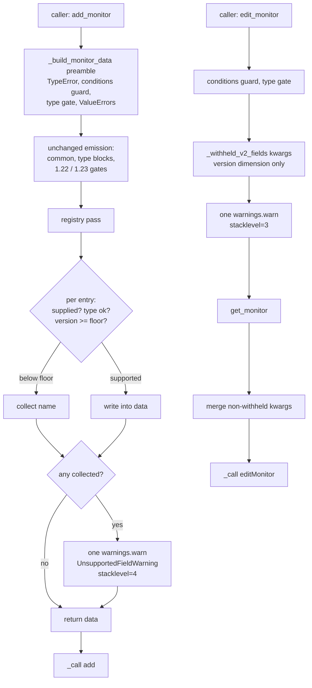

# Design

## Overview

One private module-level registry, one emission pass driven by it, one warning
category, and one new call site in `edit_monitor`. The 19-field `>= 2.0` block
and the seven in-place gates collapse into the pass; nothing else in
`_build_monitor_data` moves.

The requirements document already carries the policy reasoning, so this document
carries only what implementation forces a choice about. Seven such choices are
resolved below, each with the alternative recorded. Most of them share a property
that is the reason for writing them down at all: the wrong answer produces no
error, just a field quietly missing or a warning quietly suppressed.

All code facts below come from reading `uptime_kuma_api/api.py` at 2.3.1
directly. The workspace grep tool returns false negatives on that file.

## Dependency: the Version_Comparison_Fix lands first

Requirement 5.7. Every verdict in this design is `self._parsed_version()`
compared against `parse_version(<floor>)`, which is the same comparison every
existing gate performs, so this feature inherits whatever that helper decides —
including its current defects.

**A pre-release Server_Version is gated correctly only once the
Version_Comparison_Fix has landed.** Verified against the installed `packaging`:
`parse_version("2.0.0b1") < parse_version("2.0")` is `True`, so a 2.0 beta server
is classified as pre-2.0 by this design exactly as it is by the `1.22`, `1.23` and
`2.0` gates today, and every registry field would be withheld from it with a
warning. That is a pre-existing misclassification this feature neither creates nor
fixes; it becomes *louder* here, because a silent omission turns into a warning
naming fields the server does in fact implement.

The same applies to `None` and `""`: `parse_version(None)` raises `TypeError`,
which the `except InvalidVersion` in `_parsed_version()` does not catch, so a
`None` version escapes to the caller today from any gated path. This feature adds
no handling of its own for either (requirements 5.5, 5.6).

Sequencing consequence: the pass must not be merged ahead of the fix, or the
warning becomes the most visible symptom of a defect that is being fixed
elsewhere.

## Resolved decisions

### R1 — a registry entry carries a behaviour, and `conditions` sits in the table

**Resolved: each entry carries `behaviour`, one of withhold or raise, and
`conditions` is a registry entry with `behaviour=raise`.**

The alternative was to keep `conditions` entirely out of the registry and leave
`_check_conditions_supported` as the only statement of its behaviour. Rejected:
requirement 1.4 makes the *test* normative — a field that changes the monitor's
verdict raises, a field that changes how the check runs is withheld — and a test
that lives only in prose is a test a reviewer can skip. With `behaviour` in the
entry, adding a field forces the author to write down which side of the test the
field falls on, and `test_exactly_one_registry_entry_raises` makes requirement 1.4
executable: the count of raise-behaviour entries is one, and a second one has to
justify itself against a failing test rather than against a paragraph.

**Conceded asymmetry.** `conditions` still keeps its hand-written *emission* line
on the supported side, because requirements 6.2 and 6.3 impose a value rule no
other field has: the caller's list must reach the payload as the same object by
identity, and `None` must become `[]`. Encoding that as a per-entry coercion slot
would add a third dimension to the entry shape used exactly once. So the entry
governs `conditions`' gating and its behaviour; three lines at the top of the pass
govern its value. The raise itself does not move — it stays in
`_check_conditions_supported`, called from the preamble, which is what keeps
requirement 2.5's "no `getMonitor` round trip is spent on a call that fails"
property intact.

### R2 — how the rule reaches `edit_monitor`

`edit_monitor` never calls `_build_monitor_data`. It reads the monitor, merges
`kwargs` over it, and sends the result:

```python
self._check_conditions_supported(kwargs.get("conditions"))
self._check_monitor_type_supported(kwargs.get("type"))
data = self.get_monitor(id_)
data.update(kwargs)
```

Both existing guards read `kwargs`, never the merged `data`. That precedent
exists for a reason worth restating: a v2-only key can arrive from `get_monitor`,
and a key the server sent is not a request the caller made.

**Resolved: compute the withheld set from `kwargs` before the merge, then merge
only the keys that were not withheld.**

```python
withheld = self._withheld_v2_fields(kwargs)
self._warn_withheld_v2_fields(withheld, stacklevel=3)
data = self.get_monitor(id_)
data.update({k: v for k, v in kwargs.items() if k not in withheld})
```

This gets both halves right without a special case. The caller's below-floor value
never enters the payload, and a key that came from `get_monitor` is left exactly
as the server sent it — including a key the caller also named, which keeps its
server-side value rather than being deleted. Deleting keys after the merge was the
alternative and it is the one that alters data the server sent: `del data[key]`
cannot distinguish "the caller put this here" from "the server did", so a monitor
carrying a v2-only column would lose it on any unrelated edit.

**The type dimension is deliberately not applied on this path.** `edit_monitor`
applies no monitor-type restriction today: `edit_monitor(id_, ipFamily="ipv6")`
against a 2.x REDIS monitor sends `ipFamily`, because the merge is unconditional.
Applying the registry's type sets here would newly drop that field on 2.x, which
requirement 6.1 forbids. Reading the type from the merged monitor to avoid that
would break the other way: `edit_monitor(id_, saveResponse=True)` supplies no
`type`, so a `kwargs`-only lookup yields `None`, `None` is outside every type set,
and the field would be omitted at *every* version — a silent regression on 2.x for
the most ordinary edit call there is. So requirement 4.5's "at every
Server_Version" is scoped to the add path, where the restriction already exists
and where `type` is a required parameter. Recorded rather than left implicit,
because the reading is not the only available one.

`_withheld_v2_fields` therefore takes an optional monitor type: the add path
passes it, the edit path does not, and an entry with a type set is skipped
entirely when no type is supplied.

### R3 — three `warnings` hazards, each of which fails silently

**`stacklevel` differs between the two paths, and getting it wrong is invisible.**
From inside the helper, the frames are: helper (1), `_build_monitor_data` (2),
`add_monitor` (3), caller (4) on the add path; helper (1), `edit_monitor` (2),
caller (3) on the edit path. So the helper takes `stacklevel` as a parameter and
each call site passes its own — 4 from `_build_monitor_data`, 3 from
`edit_monitor`. Having the helper return the message string and letting each site
call `warnings.warn` itself was the alternative; rejected because it puts the
`warn` call in two places, which is where the message format drifts. A wrong
`stacklevel` does not raise: it merely blames `api.py` for the caller's mistake,
and `catch_warnings` captures the record regardless, so the unit suite cannot see
the error. One targeted assertion on `w[0].filename` is what catches it.

**Python's default filter shows a warning once per (message, category, module,
lineno), which is not the same thing as requirement 2.1's "exactly one Signal per
call".** Requirement 2.1 is a statement about the Library: one `warnings.warn`
call per `add_monitor` / `edit_monitor` call that withholds anything. Whether the
machinery *displays* it is the caller's filter configuration, and under the
default `"default"` action a loop of fifty identical `add_monitor` calls displays
one warning. That is correct behaviour and it is also a trap for the tests: a test
that calls the code twice and counts stderr proves nothing. Every test in this
change wraps the call in `warnings.catch_warnings()` with
`simplefilter("always")`, which works because mutating the filters bumps the
warnings module's internal filter version and invalidates the per-module
`__warningregistry__` entries that would otherwise suppress the repeat. Stated
here because it is the mechanism the whole test class rests on.

**Field order in the message must be deterministic.** The pass iterates the
registry in its literal declaration order, not over `kwargs` (caller order, so
two callers passing the same fields get two different messages) and not over a
`set` (hash order, so the *same* call can produce two different messages across
interpreter runs). The second is the dangerous one: because the dedup key includes
the message text, a set-ordered message means the same call warns once on one run
and twice on the next, and the test that catches it is flaky rather than red.

### R4 — where the Warning_Category lives, and what it subclasses

**Resolved: `UnsupportedFieldWarning`, subclassing `UserWarning`, defined in
`uptime_kuma_api/exceptions.py`.**

`exceptions.py` currently holds `UptimeKumaException` and `Timeout`, so a warning
class there looks out of place until two facts are lined up: Python's `Warning` is
itself a subclass of `Exception`, and under requirement 2.10's opt-in
`simplefilter("error", UnsupportedFieldWarning)` the class literally *is* raised.
It belongs with the other things the library throws at the caller. The alternative
was a new `uptime_kuma_api/warnings.py` module, which fits the repo's
one-concept-per-module convention (`auth_method.py`, `monitor_status.py`) but
shadows a stdlib name inside the package while `api.py` needs the stdlib
`warnings` in the same file — legal under absolute imports, confusing to read.
Cost of the chosen home: the module name is now slightly narrower than its
contents, mitigated by the class docstring stating plainly that
`except UptimeKumaException` does **not** catch it.

`UserWarning` rather than `RuntimeWarning` because this reports something the
*caller* did — supplied a field the connected server cannot accept — not dubious
runtime behaviour. `DeprecationWarning` was rejected twice over: it is filtered
out by default outside `__main__`, which would make the Signal invisible to
exactly the callers who need it, and nothing here is deprecated.

The name is not `V2OnlyFieldWarning`. Floors are per-field (requirement 4.8) and
issue #28 already has a field cousin at `2.1`, so a name that hard-codes the 2.0
boundary would be wrong on arrival. It is not `UptimeKumaWarning` either: a
name that generic says nothing a caller can filter *on*, and it pre-empts the
namespace for unrelated future warnings. Honest tradeoff: if a second, unrelated
warning kind ever arrives, it should not subclass `UnsupportedFieldWarning`, and
introducing a shared base then is additive.

This is the change's one new public name (requirements 6.9, 6.10): exported from
`uptime_kuma_api/__init__.py` beside `UptimeKumaException` and `Timeout`, and
added to `docs/api.rst` under `Exceptions` as `.. autoexception::`. Sphinx autodoc
has no discovery mechanism and emits no warning for an omitted export, so the
docs half cannot be deferred.

**One correction to the record.** Requirement 2.9 states the package imports
neither `warnings` nor `logging` today. `warnings` is correct; `logging` is not —
`UptimeKumaApi.__init__` does a function-local `import logging` to type-check its
`logger` parameter, which it forwards to `socketio.Client`. That matters for
requirement 7.11's fallback: if `warnings` output pollutes Ansible module output
and the Signal has to move to `logging`, the library would then have two unrelated
logger concepts in one class — socketio's, supplied by the caller, and its own.
The fallback stays viable, but it is not free.

### R5 — the entry shape

Three dimensions, no per-field branches:

```python
from collections import namedtuple   # new import in api.py

_FieldRule = namedtuple("_FieldRule", ("floor", "types", "behaviour"))
```

A `namedtuple` rather than a plain tuple so the pass reads `rule.types` instead of
`rule[1]`, and rather than a `dataclass` so nothing depends on a Python version
above the declared 3.8 floor. It is also immutable, which matters for a
module-level table a caller could otherwise reach through the class.

- `floor` — the Version_Floor as a **string**, e.g. `"2.0"`, parsed with
  `parse_version` at comparison time. Pre-parsing into `Version` objects at import
  was the alternative; the string wins because requirement 2.1 needs the floor
  verbatim in the message, and inline `parse_version("2.0")` is what every
  existing gate already does, so the pass introduces no new idiom.
- `types` — a `frozenset` of `MonitorType` members, or `None` for unrestricted.
  `None`, emphatically not an empty `frozenset`: an empty set is a valid value
  meaning "no type qualifies", so a typo that produces one would omit the field
  everywhere at every version, silently.
- `behaviour` — `_WITHHOLD` or `_RAISE` (R1).

`MonitorType` is declared `class MonitorType(str, Enum)` and inherits
`str.__hash__`, so a `frozenset` of members matches a caller who passes the bare
string `"http"` as well as one who passes the enum member — confirmed by
experiment (`'http' in frozenset({MonitorType.HTTP})` is `True`), not assumed.
`_V2_ONLY_MONITOR_TYPES` already relies on the same property.

This shape is what removes the four hand-written type lists. `ipFamily` carries
the 14-type set, the nine HTTP fields share the 4-type set, the seven in-place
fields carry a single-member set each, and the eight low-priority fields carry
`None`. The pass reads `rule.types` and never asks which field it is holding —
which is the point: a registry keyed on field name alone would emit `ipFamily`
for a REDIS monitor.

Requirement 4.8 keeps this structure separate from issue #28's per-monitor-type
floor map. They share the name-to-floor shape so the pre-release comparison is
written once; merging them would put fields and types in one namespace where a
collision is possible and meaningless.

### R6 — what the pass replaces, and what it must not touch

Replaced, all inside `_build_monitor_data`:

- The single `if self._parsed_version() >= parse_version("2.0"):` block near the
  end — `conditions`, `ipFamily` with its inline 14-type list, the nine HTTP
  fields with their inline 4-type list, and the eight low-priority fields with
  their inline `for field, value in [...]` loop. 19 names.
- Seven in-place gates: `jsonPathOperator` inside the `JSON_QUERY` block,
  `snmp_v3_username` inside the `SNMP` block, `ping_count` / `ping_numeric` /
  `ping_per_request_timeout` inside `if type == PING: if >= 2.0:`, and
  `mqttWebsocketPath` / `mqttCheckType` inside `if type == MQTT: if >= 2.0:`.

Not touched, and the pass must be reviewed against this list rather than against
a general instinct that version gates belong in the registry:

- The `1.22` gate emitting `parent`.
- The three `1.23` gates: `invertKeyword` inside the KEYWORD / GRPC_KEYWORD block,
  `timeout` in the common block, `gamedigGivenPortOnly` inside the GAMEDIG block.
- The `1.23.1` gate in `set_settings`, which is outside `_build_monitor_data`
  entirely.
- Every unconditional type-specific emission: the `grpc*` block, `databaseQuery`,
  `docker_*`, `radius*`, `kafkaProducer*` with its `saslOptions` defaulting, the
  `rabbitmq*` block with its `json.dumps`, `snmpOid` / `snmpVersion`,
  `smtpSecurity`, `system_service_name`, and the `port` defaulting that assigns
  53 / 1812 / 161 / 25 by type.
- The preamble's validation: the `conditions` `TypeError`, and the
  `responseMaxLength`, `mqttCheckType` and `mqttWebsocketPath` `ValueError`s. All
  four fire on both majors and none of them is a version gate.

`snmp_v3_username` moves into the registry even though the Type_Gate makes it
unreachable on a pre-2.0 server (requirement 1.2). It is in the class, its 2.x
emission must be preserved, and leaving it out would be the one hand-written
exception that makes the pass look optional.

One benign consequence: `data`'s key insertion order shifts, because seven fields
now enter at the pass instead of inside their type blocks. No requirement
constrains key order, `_convert_monitor_input` and `_check_arguments_monitor` are
key-lookup based rather than order-based, and dict equality ignores order, so the
existing payload-equality tests are unaffected.

### R7 — where the pass sits

**Resolved: the pass stays at the tail of `_build_monitor_data`, exactly where the
`>= 2.0` block is today. Nothing is inserted into the preamble.**

The preamble order is preserved untouched: `conditions` `TypeError`, then
`_check_conditions_supported`, then `_check_monitor_type_supported`, then the
three `ValueError`s. A call that trips both the `conditions` raise and a v2-only
type still raises the message it raised at 2.3.1.

The alternative was a preamble-sited step that decides the withheld set and warns
there, next to the two existing guards. It loses on two counts. First, it needs a
second walk of the registry later to actually emit the supported fields, so the
"single pass" ratified in decision 4 becomes two passes that can disagree.
Second, it puts the warning *ahead* of the three `ValueError`s, so
`add_monitor(..., responseMaxLength=0)` against a 1.23 server would emit a warning
about a field and then raise about the same field — a Signal describing a call
that never happens. Tail placement keeps validation version-independent and first,
and still satisfies requirement 2.7: `_build_monitor_data` returns before
`add_monitor` reaches `self._call('add', data)`.

The edit path warns *before* `self.get_monitor(id_)` rather than at the merge, so
requirement 2.10's escalated exception costs no `getMonitor` round trip — the same
property the `conditions` guard already holds.

## Architecture



## Components and Interfaces

### Module scope, beside `_V2_ONLY_MONITOR_TYPES`

```python
_WITHHOLD = "withhold"
_RAISE = "raise"

_FieldRule = namedtuple("_FieldRule", ("floor", "types", "behaviour"))

_IP_FAMILY_TYPES = frozenset({...})   # the 14 types the inline list holds today
_HTTP_V2_TYPES = frozenset({
    MonitorType.HTTP, MonitorType.KEYWORD,
    MonitorType.JSON_QUERY, MonitorType.REAL_BROWSER,
})

# Monitor fields Uptime Kuma only accepts from the stated version onward. A
# caller-supplied value below the floor is withheld from the payload and reported
# once per call as an UnsupportedFieldWarning; `conditions` alone raises, because
# it changes the monitor's up/down verdict rather than how the check runs. See
# docs/api.rst, "Version-gated monitor fields".
# Declaration order is the order withheld fields appear in the warning message
# and must stay stable.
_V2_ONLY_MONITOR_FIELDS = {
    "conditions":  _FieldRule("2.0", None, _RAISE),
    "ipFamily":    _FieldRule("2.0", _IP_FAMILY_TYPES, _WITHHOLD),
    "cacheBust":   _FieldRule("2.0", _HTTP_V2_TYPES, _WITHHOLD),
    # ... 8 more HTTP fields, 8 low-priority (types=None), 7 in-place
}
```

### Two private methods on `UptimeKumaApi`

```python
    def _withheld_v2_fields(self, supplied, type_=None) -> list[str]:
        """
        Names the version-gated monitor fields a call cannot send.

        Iterates the registry in declaration order so the returned order -- and
        therefore the warning message and its dedup key -- is stable.

        :param dict supplied: The caller-supplied values, keyed by parameter name.
                              A key mapped to None counts as not supplied.
        :param type_: The monitor type, when the caller named one. Entries
                      carrying a type restriction are skipped when it is None,
                      which is the edit path: see design R2.
        :return: The withheld field names, in registry declaration order.
        :rtype: list[str]
        """

    def _warn_withheld_v2_fields(self, withheld, stacklevel) -> None:
        """
        Reports withheld fields once, as a single UnsupportedFieldWarning.

        :param list withheld: Field names from :meth:`_withheld_v2_fields`.
        :param int stacklevel: Frames to skip so the warning blames the caller:
                               4 from _build_monitor_data, 3 from edit_monitor.
        :raises UnsupportedFieldWarning: If the caller has escalated the category
                                         with warnings.simplefilter("error", ...).
        """
```

`_withheld_v2_fields` consults `behaviour` for exactly one purpose: it skips
`_RAISE` entries, so a `_RAISE` field never appears in a Signal. That is what
keeps requirement 2.5's "no Signal for that call" true — by the time the pass
runs, a truthy `conditions` below 2.0 has already raised in the preamble, and a
falsy one was never a request.

`_WITHHOLD` and `_RAISE` are plain strings compared with `==`, not `is`. String
identity happens to work for module-level literals and is exactly the kind of
thing that stops working when a registry entry is built somewhere else; the
strings are strings rather than `object()` sentinels so that a `_FieldRule` repr
is readable when the table is being debugged.

### The pass, replacing the `>= 2.0` block

```python
        # conditions keeps its own emission: the caller's list must reach the
        # payload as the same object, and None must become [] (requirements
        # 6.2, 6.3). No other field has a value rule.
        if self._parsed_version() >= parse_version("2.0"):
            data["conditions"] = conditions if conditions is not None else []

        local_values = locals()
        supplied = {name: local_values[name] for name in _V2_ONLY_MONITOR_FIELDS}
        withheld = self._withheld_v2_fields(supplied, type)
        for name, rule in _V2_ONLY_MONITOR_FIELDS.items():
            if rule.behaviour == _RAISE or name in withheld:
                continue
            value = supplied[name]
            if value is None:
                continue
            if rule.types is not None and type not in rule.types:
                continue
            data[name] = value
        self._warn_withheld_v2_fields(withheld, stacklevel=4)
```

`local_values` is `locals()` captured once immediately before the pass. The
alternative is 25 explicit `"name": name` pairs, which is 25 more places for a
typo that fails silently — a mistyped key yields `None`, and `None` means "not
supplied", so the field is neither emitted nor reported. A `locals()` read is
unusual enough to warrant the comment; the safeguard is
`test_every_registry_key_is_a_build_monitor_data_parameter`, which compares the
registry's keys against `inspect.signature(_build_monitor_data).parameters` and
fails on a name that is not a real parameter.

## Data Models

The registry, as 26 entries. Behaviour is withhold except where stated.

| Field | Floor | Types | Notes |
|---|---|---|---|
| `conditions` | 2.0 | none | **raise**; emission hand-written (R1) |
| `ipFamily` | 2.0 | 14 | inline list today |
| `cacheBust`, `retryOnlyOnStatusCodeFailure`, `bearer_token`, `oauth_audience`, `domainExpiryNotification`, `saveResponse`, `saveErrorResponse`, `responseMaxLength`, `responsecheck` | 2.0 | HTTP, KEYWORD, JSON_QUERY, REAL_BROWSER | `responseMaxLength` also range-validated in the preamble |
| `subtype`, `wsSubprotocol`, `wsIgnoreSecWebsocketAcceptHeader`, `remoteBrowsersToggle`, `remote_browser`, `screenshot_delay`, `gamedigToken`, `protocol` | 2.0 | none | unrestricted |
| `jsonPathOperator` | 2.0 | JSON_QUERY | in place today |
| `snmp_v3_username` | 2.0 | SNMP | in place today; not Reachable_On_V1 |
| `ping_count`, `ping_numeric`, `ping_per_request_timeout` | 2.0 | PING | in place today |
| `mqttWebsocketPath`, `mqttCheckType` | 2.0 | MQTT | in place today; both also validated in the preamble |

Every floor is `2.0` at 2.3.1. The floor is per-entry rather than a shared
constant so that issue #28's `2.1` cousin needs a data edit and no code change
(requirement 4.6).

**The Verification_Run can shorten this table.** Requirement 7.2: a field a
1.23.x server accepts and returns unchanged is not v2-only, and an `ACCEPTED`
verdict removes its row. Removal is the whole edit — the field then reaches the
payload unconditionally, wherever it was emitted before, and no warning mentions
it. That is why the run precedes the code (requirement 7.3): building the registry
first and pruning it afterwards would mean a shipped warning about a field the
server would have taken.

## Correctness Properties

*A property is a characteristic or behavior that should hold true across all
valid executions of a system — essentially, a formal statement about what the
system should do. Properties serve as the bridge between human-readable
specifications and machine-verifiable correctness guarantees.*

### Property 1: The verdict flips exactly at the entry's own floor

*For any* registry entry, any monitor type permitted by that entry, any non-`None`
value and any parseable Server_Version, the field's key is present in the payload
holding the value supplied when the version is at or above the entry's floor, and
absent when it is below — with the version equal to the floor falling on the
present side.

**Validates: Requirements 1.1, 1.2, 4.1, 4.2, 5.2, 6.1**

### Property 2: A type restriction is absolute across versions

*For any* registry entry carrying a type set, any monitor type outside that set
and any Server_Version, the field's key is absent from the `add_monitor` payload.

**Validates: Requirements 4.4, 4.5**

### Property 3: One Signal per call, naming exactly the withheld set

*For any* non-empty subset of registry fields supplied with non-`None` values on a
Server_Version below their floors, a single `UnsupportedFieldWarning` is emitted
whose message names every member of that subset together with its floor and the
Server_Version the `version` property reports, names no field the call sent, and
is byte-identical across repeated evaluations of the same call.

**Validates: Requirements 2.1, 2.2, 2.3, 4.9**

### Property 4: Withholding costs the caller nothing else

*For any* call that withholds at least one registry field, every other field the
caller supplied that the server at that Server_Version supports is present in the
payload holding the value supplied.

Requirement 2.7's other half — that `add_monitor` and `edit_monitor` return the
value and key set 2.3.1 returns — is structural rather than generated: both
methods still `return self._call(...)` unchanged, and the pass runs strictly
before that line. One assertion that the return value is the `_call` result covers
it; there is nothing for a generator to vary.

**Validates: Requirements 2.7, 9.5**

### Property 5: A call naming no registry field is silent and unchanged

*For any* set of non-registry monitor arguments and any Server_Version, the
payload equals the payload version 2.3.1 builds for the same arguments, no
`UnsupportedFieldWarning` is emitted, no log record at WARNING or above is
emitted, and no exception is raised.

**Validates: Requirements 1.11, 2.4, 9.1**

### Property 6: A call whose fields are all supported is silent

*For any* subset of registry fields supplied with permitted types on a
Server_Version at or above every floor that subset touches, no
`UnsupportedFieldWarning` and no log record at WARNING or above is emitted, and
every supplied key is present in the payload.

**Validates: Requirements 2.6, 6.5**

### Property 7: Gates outside the registry are untouched

*For any* generated PEP 440 Server_Version and any monitor field absent from the
registry, the payload's key presence and value equal those version 2.3.1 produces
at that Server_Version, on the `add_monitor` path and the `edit_monitor` merge
path alike — including at the `1.22`, `1.23`, `1.23.1` and `2.0` boundaries.

**Validates: Requirements 4.7, 5.4, 6.6**

### Property 8: An unparseable version is treated as newest

*For any* unparseable Server_Version string and any registry entry, the field is
emitted for a permitted type and no `UnsupportedFieldWarning` is emitted.

**Validates: Requirements 5.3**

### Property 9: `conditions` reaches a 2.x payload by identity

*For any* list, a `conditions` value supplied on a Server_Version at or above 2.0
appears in the payload as that same object by identity, empty list included; and
`conditions=None` yields a payload holding `[]` under the same key.

**Validates: Requirements 6.2, 6.3**

### Property 10: The edit merge preserves the server's data and the caller's precedence

*For any* `get_monitor` response and any caller keyword arguments, the payload
sent to `editMonitor` equals the response updated by exactly those arguments the
registry did not withhold, so every key the caller did not name — including a
v2-only key the server itself returned — is unchanged, and every non-withheld key
the caller did name holds the caller's value.

**Validates: Requirements 9.2, 9.3**

### Deliberately not new properties

Requirement 6.4 — a non-list, non-`None` `conditions` value raises `TypeError`
carrying `conditions must be a list or None`, before any version comparison, on
both majors — is already pinned by an existing test in
`TestConditionsPreservation` (the "TypeError still precedes any version handling"
group, which asserts it at `1.23.2` and at `2.4.0`). R7 keeps the preamble order
that test depends on, so restating it as a property here would add a second copy
of an assertion that already exists and already passes. It is listed in the
prework as testable and is covered; it is not re-covered.

Requirements 1.8, 1.9 and 6.7 are the same case: the Type_Gate's class and message
are pinned by `TestV2OnlyMonitorTypesV1Gate`, and `MonitorBuilder` is not touched
by this change.

## Error Handling

| Situation | Outcome | Where |
|---|---|---|
| `conditions` not a list and not `None` | `TypeError("conditions must be a list or None")`, both majors, before any version comparison | preamble, unchanged |
| truthy `conditions` below 2.0 | `UptimeKumaException`, no Signal, no server call | `_check_conditions_supported`, unchanged |
| v2-only monitor type below 2.0 | `UptimeKumaException`, message unchanged from 2.3.1 | `_check_monitor_type_supported`, unchanged |
| `responseMaxLength` out of range, bad `mqttCheckType`, over-long `mqttWebsocketPath` | `ValueError`, both majors, before the pass | preamble, unchanged |
| registry field supplied below floor | withheld, one `UnsupportedFieldWarning` | the pass / `edit_monitor` |
| the same, with `simplefilter("error", UnsupportedFieldWarning)` | the warning is raised, no payload sent | caller's filter |
| Server_Version unparseable | every field treated as supported, no Signal | `_parsed_version()`, unchanged |
| Server_Version `None` or `""` | `TypeError` escapes, as at 2.3.1, until the Version_Comparison_Fix lands | `_parsed_version()` |

No new exception class. `UnsupportedFieldWarning` is a `Warning`, so
`except UptimeKumaException` does not catch it — stated in its docstring, because
the class lives in `exceptions.py` (R4) and the assumption would otherwise be
reasonable.

## Testing Strategy

`tests/test_monitor_params_v2.py`, new classes only (requirements 8.1, 8.2). No
new file: the file is already collected by a bare `pytest`, and `conftest.py`
marks only `UptimeKumaTestCase` subclasses `integration`, so a class added here
needs no CI, docs or steering edit.

`TestValidVersionGatePreservation` and `TestUnparseableVersionBugCondition` are
left unmodified (requirement 8.9) and must pass in the same run — their generated
version corpus is what Property 7 and Property 8 lean on, and an untouched class
that is never run proves nothing.

Four new classes:

- **`TestV2OnlyFieldsWithheld`** — Properties 1, 2, 4. Parametrised over the
  registry rather than over a hand-picked field, so a future entry is covered on
  arrival. At least one field from each of the five groups in the requirements
  table, `snmp_v3_username` excluded as not Reachable_On_V1 (requirement 8.3).
- **`TestV2OnlyFieldsSignal`** — Properties 3, 6, and the two
  `simplefilter("error")` examples. Every test wraps the call in
  `warnings.catch_warnings()` + `simplefilter("always")` (R3), and one test
  asserts `w[0].filename` is the test module rather than `api.py`, which is the
  only thing that catches a wrong `stacklevel`.
- **`TestV2OnlyFieldsEditPath`** — Property 10, plus the assertion that
  `get_monitor` is not reached when the escalated warning raises.
- **`TestV2OnlyFieldsPreservation`** — Properties 5, 7, 8, 9, the registry
  privacy assertions mirroring the existing `_V2_ONLY_MONITOR_TYPES` test
  (requirement 4.3), `issubclass(UnsupportedFieldWarning, UserWarning)`,
  `inspect.signature` equality for `add_monitor` / `edit_monitor`, and the
  one-new-public-name set difference (requirements 6.8, 6.10).

Mechanics, following the file's existing idiom exactly (requirement 8.10): a
`MagicMock(spec=UptimeKumaApi)` with `version` set, and the real
`_parsed_version`, `_check_conditions_supported`, `_check_monitor_type_supported`,
`_withheld_v2_fields`, `_warn_withheld_v2_fields` and `_build_monitor_data` bound
onto it — a spec'd mock stubs out anything not bound, so an unbound guard would
never run and the test would pass vacuously. No live server, no socket, at
collection or execution.

Generated inputs use the file's seeded `PBT_SEED` / `PBT_CASES` idiom, not
`hypothesis`, which is not a project dependency (requirement 8.12). Two generator
obligations that the properties depend on and that a naive generator misses:

- **Falsy-but-not-`None` values.** `saveResponse=False`, `cacheBust=False`,
  `responsecheck=""`, `screenshot_delay=0` must appear in the corpus, because the
  emission test is `is not None` and requirements 1.10 / 2.8 make these
  withheld-and-announced. A truthy-only generator would leave the whole edge
  uncovered while every property still passed. Note which falsy value goes with
  which field: `responseMaxLength=0` is not usable here, because the preamble
  `ValueError` rejects it before the pass runs on either major.
- **Versions on both sides of `2.0` and exactly at it**, reusing
  `CANONICAL_VALID_VERSIONS` so `1.23.2` and `2.4.0` — the two mocked versions the
  file already uses — are always in the corpus alongside the `2.0` boundary.

Test output is ASCII only (requirement 8.12): `PASS` / `FAIL` / `->`.

**Provably red against 2.3.1.** Properties 1 through 4, 6 and 10 fail against
2.3.1: today's code withholds silently, so the warning assertions have nothing to
catch, and `edit_monitor` merges a below-floor field straight through. Properties
5, 7, 8 and 9 are preservation and are expected green both before and after —
that is what they are for. Per `testing.md`, the red run is performed and recorded
before the fix lands; a property that has only ever passed is not evidence.

## Verification_Run (requirement 7)

`tests/live_test_v2_only_fields_v1.py`, modelled on
`tests/live_test_conditions_v1.py` and sharing its safety posture: its own
`UPTIME_KUMA_V1_URL` / `UPTIME_KUMA_V1_USERNAME` / `UPTIME_KUMA_V1_PASSWORD` keys
rather than the 2.x `tests/.env` keys, no default URL, and an abort unless the
reported version begins with `1.23` (requirements 7.4, 7.5). It is a standalone
one-off, **not** a step in the 2.x backup → create → cleanup cycle — appending it
there would point it at the wrong server. `live_test_*.py` is excluded from the
sdist by `check_sdist.py`'s allowlist, so nothing here ships.

Per field: create a monitor of a type the field applies to with that field on the
wire, read it back, compare sent against returned, and record one of `REJECTED`,
`ACCEPTED`, `ABSENT`, `MISMATCH` (requirements 7.1, 7.6). Created monitors are
deleted in a `finally` block, including on the raising path (requirement 7.7).
Output is ASCII only, `PASS` / `FAIL` / `->` (requirement 7.8).

Results land in `.kiro/specs/v2-only-fields-rule/v1-verification-results.md`
with the observed version, the run date, and one verdict per field including
`NOT_OBSERVED` for any of the 25 not exercised, so an incomplete run reads as
incomplete (requirements 7.9, 7.10). Container host, SSH user and credentials
appear only as `<docker-host>` and `<user>`.

**The Ansible stderr check (requirement 7.11)** is recorded in the same file, not
a separate one, so a reader of the verdict table sees the carrier decision beside
it. `warnings.warn` writes to stderr through `warnings.showwarning`, and the
companion Ansible collection wraps these calls in a module process. If unexpected
stderr breaks module output parsing, `logging` is the ratified fallback: a
`logging.getLogger("uptime_kuma_api")` call at WARNING replaces the
`warnings.warn`, and every part of decision 3's reasoning survives except
filterability — a caller can no longer escalate to an exception, so requirements
2.10 and 8.7 would be dropped rather than reinterpreted. Note the wrinkle from
R4: `logging.lastResort` also emits WARNING and above to stderr when no handler
is configured, so the fallback is quieter only for a caller who configures
logging. This check must complete before the change merges precisely because
swapping carriers afterwards would be a breaking change to a name that had already
shipped.

## Documentation (requirement 3)

**One normative location: a new labelled section in `docs/api.rst`.**

```rst
.. _v2-only-fields:

Version-gated monitor fields
----------------------------
```

placed after `Main Interface`, stating all five things requirement 3.6 asks for:
the class the rule governs, where a caller finds each field's floor, how a caller
learns a field was withheld, the `UnsupportedFieldWarning` name to filter on, and
`conditions` as the single named exception with the test from requirement 1.4
quoted verbatim.

Phrased as a rule about **fields the connected server does not implement**, not
about the 26 names it governs today and not about "2.0" (requirement 1.7). That
phrasing is what makes decision 5's follow-up — extending to status pages,
maintenance and settings — a set of registry rows plus a sentence naming the wider
class, rather than a second policy to ratify. It is also what keeps the section
honest when issue #28 adds a `2.1` floor.

The alternative was the `UptimeKumaApi` class docstring. It renders in the same
place and has the advantage of reaching `help(UptimeKumaApi)`, but that docstring
is already a long connect-login-add-disconnect tutorial and a normative policy
paragraph inside it would be buried. It also gives no clean `:ref:` target, since
a label in a docstring is awkward to place and easy to break. Cost of the chosen
location: the docstring cross-references read as raw `:ref:` markup in a REPL, so
they are phrased as sentences that survive being unrendered.

`add_monitor` and `edit_monitor` each get a one-line cross-reference into their
hand-written docstring — the part in `api.py`, not the generated
`monitor_docstring("add")` block appended by `append_docstring` — and restate
nothing (requirement 3.2). Two normative copies drifting apart is this project's
recurring failure mode; the CI unit-file list that had seven copies is the
cautionary example.

Verified for requirement 3.8: `docs/conf.py` enables only `sphinx.ext.autodoc`
with `autodoc_member_order = "bysource"`, and the built `api.html` does render
method docstrings, so a `:ref:` inside `add_monitor`'s docstring resolves at build
time and a broken one warns. `docs/make.bat html` is run once and confirmed
warning-free.

Also landing in the same merged change (requirement 3.7):

- `CHANGELOG.md` under the shipping release's heading (requirement 3.3): the rule,
  every field whose behaviour changes, and what a caller relying on the old
  behaviour now observes.
- `.kiro/specs/uptime-kuma-v2-support-backlog/requirements.md`, extending 13.3's
  existing NARROWED annotation (requirement 3.4): quote
  `without raising an error or logging a warning`, and record that 13.3 rested on
  the premise that a dropped field fails observably, which the issue #12
  verification falsified for a whole subclass of fields.
- `.kiro/specs/conditions-field-v1-regression/design.md`, in its
  `## Cross-Spec Policy Conflict` section (requirement 3.5): the `conditions`
  raise is retained as the single named exception, justified by the requirement
  1.4 test.

## Changelog and version

**Non-breaking, `feat`, minor bump** (requirement 9.4): 2.3.1 → 2.4.0.

Non-breaking is a claim worth stating precisely rather than asserting. Every call
that succeeds against a pre-2.0 server today still succeeds and returns the same
value; the payload it sends is unchanged, because the fields the pass withholds
are fields 2.3.1 already omitted. What is added is a warning, and — on the edit
path only — the withholding of a caller-supplied below-floor field that 2.3.1
merged straight through to the server. That last one is the single behavioural
delta on a pre-2.0 server, and it removes a key the v1 schema has no column for,
so it turns a probable `SQLITE_ERROR` into a warning.

`feat` rather than `fix`: nothing here was broken. Both halves of the old split
worked as designed and both were documented. What ships is predictability across
the class, which is a capability the library did not have.

The entry states that `conditions` behaviour is unchanged from 2.3.1, because a
reader scanning a release that unifies the class will otherwise assume the
exception was unified away.
